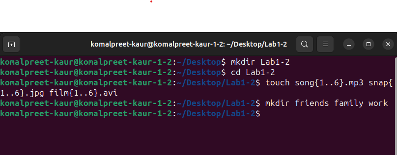
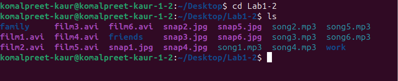
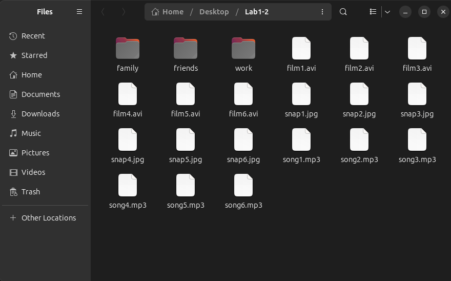

Experiment:

Use the touch command to create sets of empty practice files 
to use during this lab. In each set, replace X with the numbers 
1 through 6. Create six files with names of the form 
songX.mp3, snapX.jpg, filmX.avi. Create three subdirectories 
for organizing your files, and name the 
subdirectories friends, family, and work. Use a single 
command to create all three subdirectories at the same time. 

Screenshots of lab:

Output screenshot:

