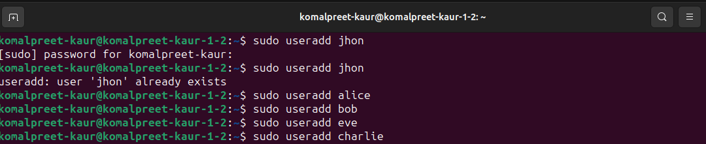
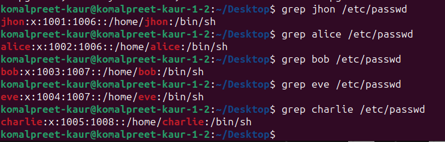
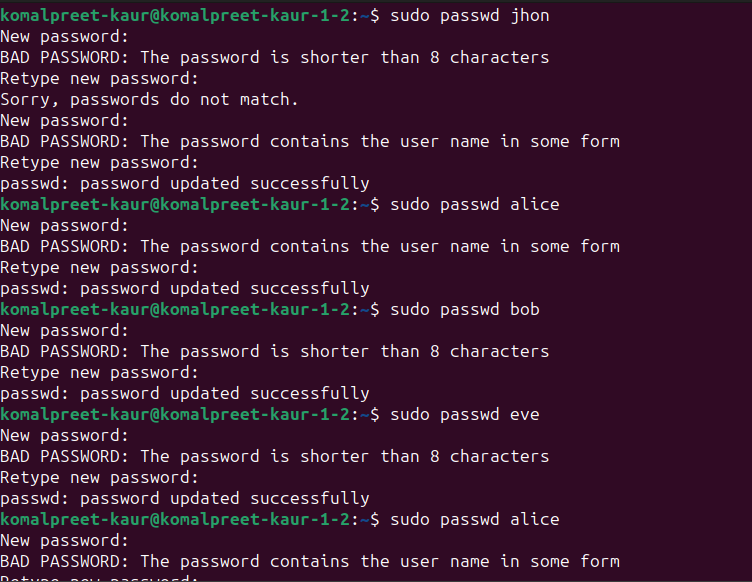
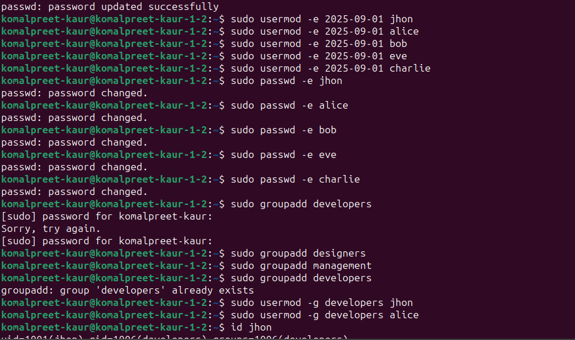
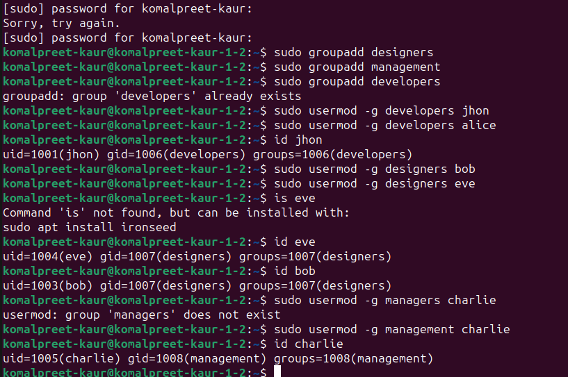
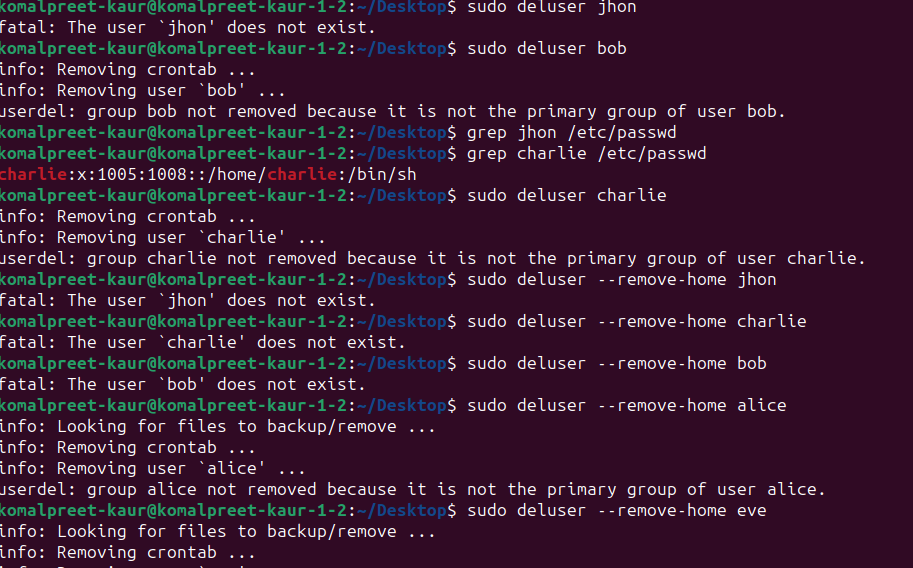
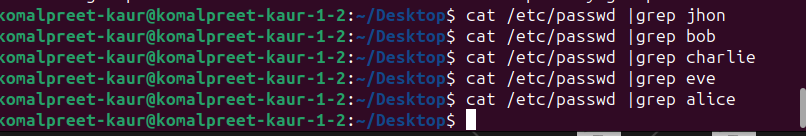

Experiment:
Create the operator1 user and confirm that it exists in the system. Set the password for operator1.
Create the additional operator2 and operator3 users. Set their passwords as well. 
Run the usermod -c command to update the comments of the operator1 user account.
Remove the operator3 user from the system. 

Terminal commands and screenshots:

verifying that user exits:

 

 

removing the users

removed succesfully hence verified

