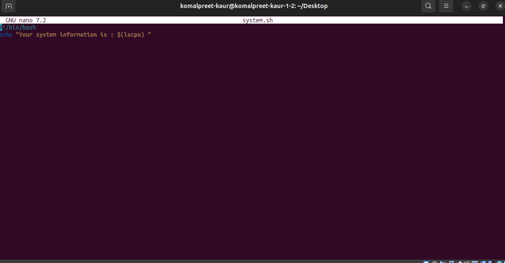
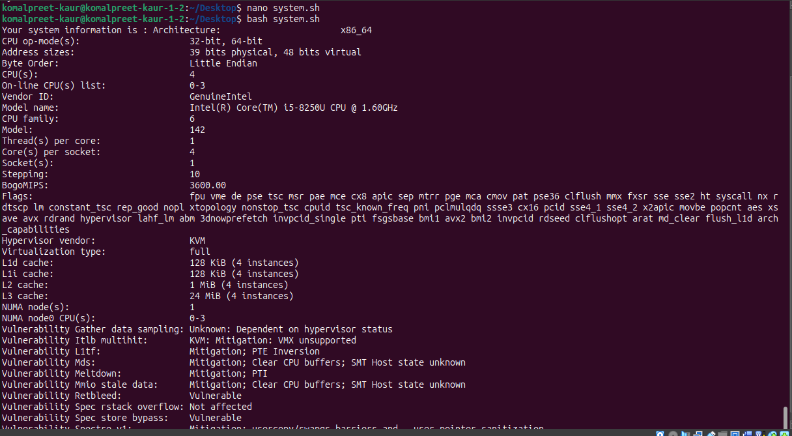
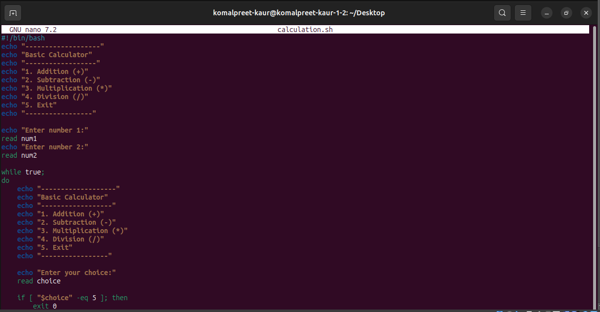
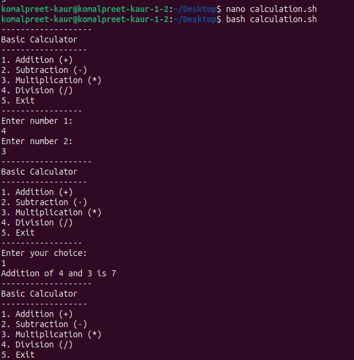
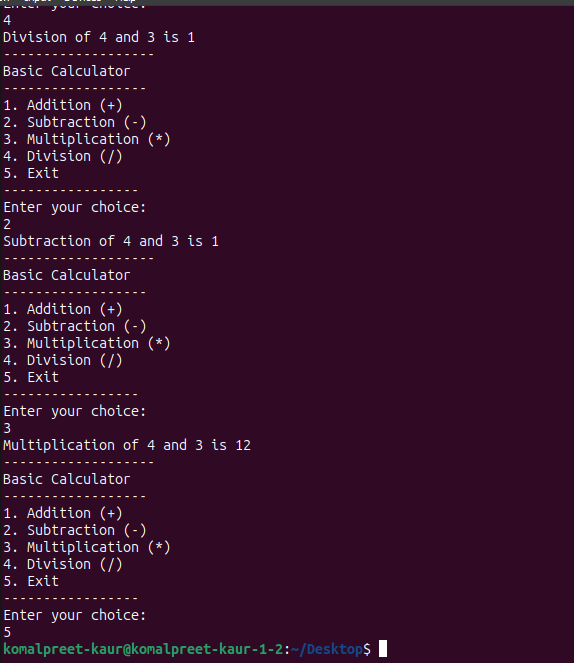

Experiment:
1) Write shell scripts to print system information. 
2) Write shell script to perform basic mathematical calculation. 
3) Use redirection operators to store the output of commands. 

Terminal commands and screenshots:
1) System Information

2) Basic mathematical calculation

Output:

3) 

