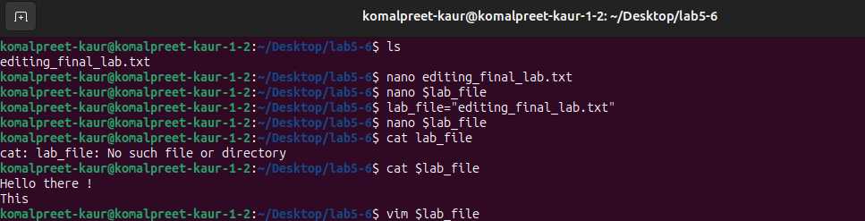
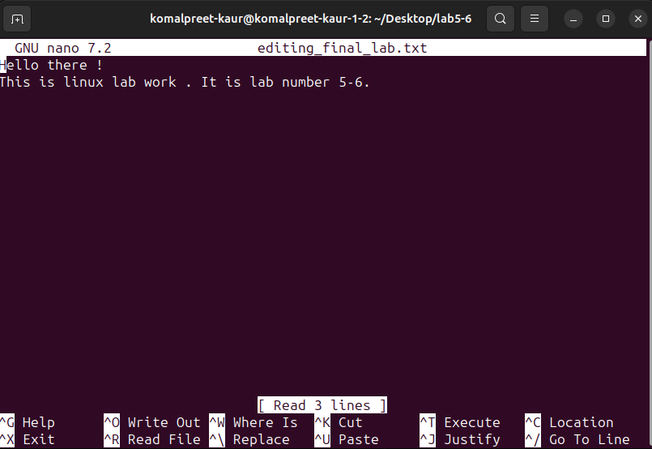
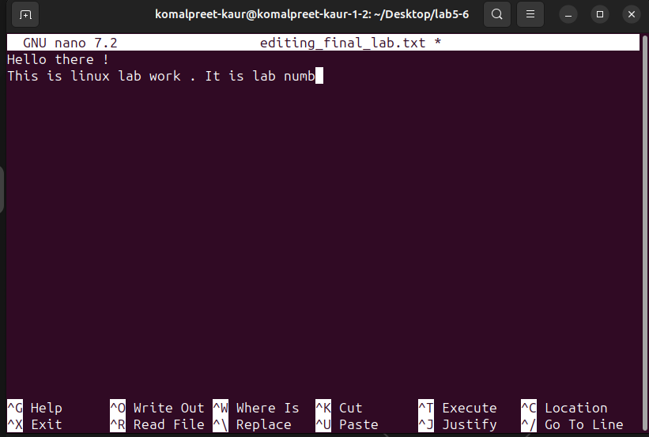

Experiment:

Use Vim,nano,to edit the editing_final_lab.txt file. Use the lab_file shell variable. Enter the visual mode of Vim. 
Remove the last seven characters from the first column on the first line. 
Preserve only the first four characters of the first column. 

Commands on the terminal:

1) Created a editing_final_lab.txt file and added content . lab_file shell variable is created

2) Opened the nano editor .

3) Deleted the last 7 characters from the first column and only first four characters are preserved from first colmn

