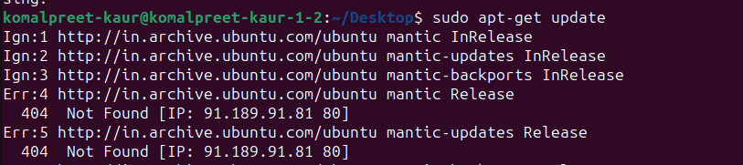

Experiment:Implement ps, top, kill command with their options. 
Installing, updating, and removing software by apt-get command. 

Terminal Commands and Screenschots:
ps: The ps command displays currently running processes. Some useful options:

ps aux : Shows all running processes with detailed info.

ps -e : Displays all running processes.

ps -u : Lists processes of a specific user.

---------------------------------------------------------------------

top:The top command provides a real-time view of system resource usage.

Press q to quit.
Use k to kill a process.
Press h for help.

-----------------------------------------------------------------

kill: The kill command is used to stop a process using its PID.
kill <PID> → Terminates a process.
kill -9 <PID> → Force kills a process.
pkill <process_name> → Kills all processes with that name.

-------------------------------------------------------------------

apt-get install

apt-get update

apt-get upgrade

apt-remove 

