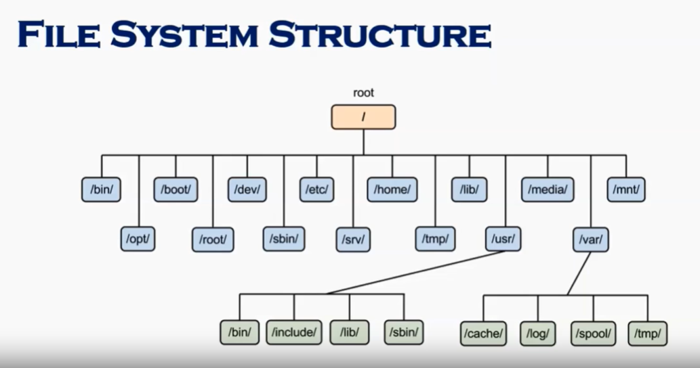
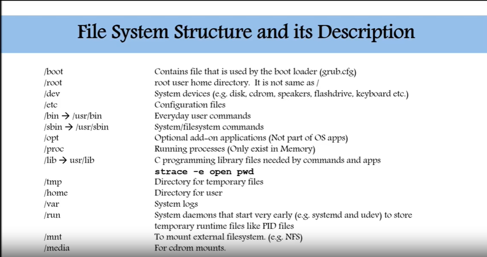

THEORY:
-------

Linux is an open-source operating system. It is like Windows, Mac, Android, etc.

Unix is also an operating system like Linux. It is an commercial OS. It consists of three parts: Kernal, Shell and Programs. Most of the Unix and Linux commands are similar in nature.
-----------------
Design of Linux OS:
Linux kernel, a monolithic kernel which manages file systems, peripheral access, networking, and process control. Device drivers are either directly integrated with the kernel or included as modules loaded while the device is active.
Bootloader, for instance, systemd-boot, SYSLINUX, LILO, and GNU GRUB. It is a program that can load the Linux kernel into the main memory of the computer by being run by the computer after the firmware login is performed and when it's turned on.

-----------------
User interface:
The user interface is called a shell.
2 Types of interfaces:
	CLI :(Command Line Interface) 
	GUI :(Grafical User Interface)
The default user interface is graphical for desktop systems. However, the CLI is available by terminal emulator windows or on an isolated virtual console.
Command-line interface shells are text-based UIs, which utilize text for both output and input. The dominant shell is the bash (Bourne-Again Shell) used in Linux, originally designed for the GNU project. Almost every low-level component of Linux, including several userland parts, exclusively use the CLI. Particularly, the CLI is compatible with delayed or repetitive task automation and gives very easy inter-process communication.

----------------------------------------

Windows use GUI mostly but Ubuntu uses both

bios- basic input output  system
booting: loading bios in Linux

In windows we use command prompt and shell , in Linux we use terminal

-------------------------
Uses of Linux OS

Web Services
Laptops and desktops
Mobile devices
Film production
Government use

--------------------
Linux OS Working

Every Linux distribution is based on the Linux kernel but can differ based on factors like:
Kernel version
kernel modules
configuration options

-----------------
Pros and Cons of Linux OS

Pros-->
Open Source 
Reliability
Licensing Cost
Backward Compatibility
Several Choices

Cons-->
Lack of standard
Support Costs
Proprietary Software
Steep Learning Curve
Unsupported Hardware
-----------------------------

Linux Bash

The Linux Bash is also known as 'Bourne-again Shell.' It is a command language interpreter for the Linux based system. It is a replacement of Bourne shell (sh)

The Bash is a command language interpreter as well as a programming language. It supports variables, functions, and flow control, like other programming languages. It can also read and execute the commands from a file, which is called a shell script.

People often get confused between bash, shell, and shell script.

What is Shell

The terminal contains the shell; it allows us to execute the commands to interact with the system. We can perform various operations such as store and retrieve data, process information, and various other simple as well as complex tasks.

------------------
Scripting:

Suppose we are required to execute some basic commands every day, for example above four commands. Linux supports a feature called scripting that allows us to execute more than one task at once. So, it is good to define a script rather than performing repetitive tasks.

* To define a script, create a file with a .sh extension.
	eg- >vi tasks.sh  
	 (enter the tasks now which on th evi editor)

	date  
	cal  
	pwd  	
	ls  
After entering the tasks, press ESC and :wq! Keys to save and exit from the editor.

Now, make the created file as executable, use the chmod command with +x option
>chmod +x tasks.sh 

Our script is created and now to execute it pre define it with './'
>./task.sh  

---------------------------------
File System Structure and Discription:

There are two paths to navigate to a file system:
1) Absolute Path-> always begins with a "/". This indicates that the path starts at the root directory .
eg- cd /var/log/samba
2) Relative Path->Does not begins with a "/". It identifies a location relative to your current position .
eg- cd /var
	cd log
	cd sambha

--------------------------------------
WildCard:
Is a character that can be used as a substitute for any of a class of a character in a search
* ->represents a zero or more characters
	eg- if there are 3 files like abc1 , abc2 abc3 
	if we want to deleate all we can write abc* and all after abc name will deleate no need to write all one by one

? ->represents a single character 
[] -> represents a range of characters
{} ->
eg touch abcd{1..9} -xyz  9 files will be created of name abcd_xyz

\ ->as an escape character

^ -> the begining of the line

$ -> the end of the line 
